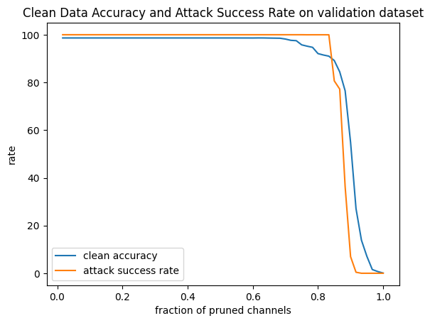

# Pruning Defense for BadNets Trained on YouTube Face Dataset

## Introduction
In response to backdoor attacks on neural networks, this report outlines the design and evaluation of a pruning defense mechanism for BadNets trained on the YouTube Face dataset. The goal is to create a resilient neural network capable of accurately classifying clean inputs while detecting and mitigating backdoor attacks.

## Methodology
The defense involves iteratively pruning BadNet's last pooling layer by removing one channel at a time, prioritizing channels with decreasing average activation values over the validation set. Pruning continues until the validation accuracy drops at least X% below the original accuracy, resulting in the new network B'. Evaluation includes a BadNet with a known backdoor and repaired networks for different pruning thresholds (X={2%, 4%, 10%}).

## Results

### Baseline Evaluation
A baseline evaluation of the backdoor attack on a DNN trained on YouTube Aligned Face Dataset achieved an accuracy rate of 98.64% on unmodified inputs and a 100% attack success rate.

### Pruning Defense Mechanism
The defense strategy involves iteratively removing neurons from the last pooling layer. The figure below depicts a significant decrease in the success rate of backdoor attacks as channels are pruned from the last pooling layer. The relationship between the classification accuracy on clean inputs and the success rate of the attack is explored.

### Table of Results
The following table summarizes accuracy on clean test data and the attack success rate on backdoored test data as a function of the fraction of channels pruned (X):

| Fraction of Channels Pruned   |   Clean Accuracy |   Attack Success Rate |
|===============================|==================|=======================|
| 1/60 (1.67%)                  |       98.649     |            100        |
| 2/60 (3.33%)                  |       98.649     |            100        |
| 3/60 (5.00%)                  |       98.649     |            100        |
| 4/60 (6.67%)                  |       98.649     |            100        |
| 5/60 (8.33%)                  |       98.649     |            100        |
| 6/60 (10.00%)                 |       98.649     |            100        |
| 7/60 (11.67%)                 |       98.649     |            100        |
| 8/60 (13.33%)                 |       98.649     |            100        |
| 9/60 (15.00%)                 |       98.649     |            100        |
| 10/60 (16.67%)                |       98.649     |            100        |
| 11/60 (18.33%)                |       98.649     |            100        |
| 12/60 (20.00%)                |       98.649     |            100        |
| 13/60 (21.67%)                |       98.649     |            100        |
| 14/60 (23.33%)                |       98.649     |            100        |
| 15/60 (25.00%)                |       98.649     |            100        |
| 16/60 (26.67%)                |       98.649     |            100        |
| 17/60 (28.33%)                |       98.649     |            100        |
| 18/60 (30.00%)                |       98.649     |            100        |
| 19/60 (31.67%)                |       98.649     |            100        |
| 20/60 (33.33%)                |       98.649     |            100        |
| 21/60 (35.00%)                |       98.649     |            100        |
| 22/60 (36.67%)                |       98.649     |            100        |
| 23/60 (38.33%)                |       98.649     |            100        |
| 24/60 (40.00%)                |       98.649     |            100        |
| 25/60 (41.67%)                |       98.649     |            100        |
| 26/60 (43.33%)                |       98.649     |            100        |
| 27/60 (45.00%)                |       98.649     |            100        |
| 28/60 (46.67%)                |       98.649     |            100        |
| 29/60 (48.33%)                |       98.649     |            100        |
| 30/60 (50.00%)                |       98.649     |            100        |
| 31/60 (51.67%)                |       98.649     |            100        |
| 32/60 (53.33%)                |       98.649     |            100        |
| 33/60 (55.00%)                |       98.649     |            100        |
| 34/60 (56.67%)                |       98.6403    |            100        |
| 35/60 (58.33%)                |       98.6403    |            100        |
| 36/60 (60.00%)                |       98.6317    |            100        |
| 37/60 (61.67%)                |       98.6577    |            100        |
| 38/60 (63.33%)                |       98.649     |            100        |
| 39/60 (65.00%)                |       98.6057    |            100        |
| 40/60 (66.67%)                |       98.5711    |            100        |
| 41/60 (68.33%)                |       98.5364    |            100        |
| 42/60 (70.00%)                |       98.19      |            100        |
| 43/60 (71.67%)                |       97.6531    |            100        |
| 44/60 (73.33%)                |       97.5058    |            100        |
| 45/60 (75.00%)                |       95.7565    |            100        |
| 46/60 (76.67%)                |       95.2022    |             99.9766   |
| 47/60 (78.33%)                |       94.7172    |             99.9844   |
| 48/60 (80.00%)                |       92.0932    |             99.9844   |
| 49/60 (81.67%)                |       91.4956    |             99.9844   |
| 50/60 (83.33%)                |       91.0193    |             99.9766   |
| 51/60 (85.00%)                |       89.1747    |             80.6469   |
| 52/60 (86.67%)                |       84.4375    |             77.2097   |
| 53/60 (88.33%)                |       76.4874    |             36.2666   |
| 54/60 (90.00%)                |       54.8627    |              6.96025  |
| 55/60 (91.67%)                |       27.0893    |              0.420889 |
| 56/60 (93.33%)                |       13.8737    |              0        |
| 57/60 (95.00%)                |        7.10141   |              0        |
| 58/60 (96.67%)                |        1.55019   |              0        |
| 59/60 (98.33%)                |        0.718801  |              0        |
| 60/60 (100.00%)               |        0.0779423 |              0        |

## Conclusion
The pruning defense mechanism offers a dynamic approach to fortify neural networks against backdoor attacks. The results demonstrate a notable decrease in the success rate of attacks as channels are pruned, highlighting the effectiveness of this strategy in maintaining high accuracy on clean inputs while mitigating backdoor vulnerabilities. The provided GitHub repository includes the code for the defense implementation and evaluation script for further exploration and validation.
